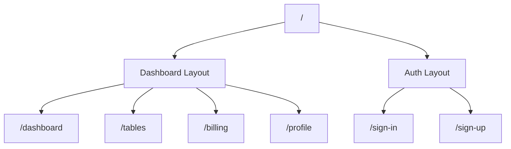

# Architecture Notes: Purity UI Dashboard Conversion

This document details the architectural decisions, structural patterns, and coding conventions established for the Purity UI Dashboard conversion codebase.

---

## 1. Directory Structure & Rationale

We implement a modular, clean folder layout designed to decouple reusable UI controls, page-specific templates, routing definitions, static data layers, and visual assets.

```txt
src/
├── assets/          # Static media, SVG icons, and design images
│   ├── images/      # Optimized reference and background assets
│   └── icons/       # Custom vector SVG elements
├── components/      # UI components split by isolation level
│   ├── common/      # Reusable base/primitive controls (Card, Button, Badge)
│   ├── layout/      # Application shells (Sidebar, Topbar, AuthNavbar, Footer)
│   ├── dashboard/   # Dashboard page specific elements (Charts, welcome card)
│   ├── tables/      # Table-page wrappers and headers
│   ├── billing/     # Credit cards, invoice templates, billing items
│   ├── profile/     # Settings switches, user headers, conversation lists
│   └── auth/        # Login and registration form controls
├── data/            # Static data structures mock-ups (invoices, stats)
├── pages/           # High-level route views (Dashboard.jsx, Profile.jsx)
├── routes/          # Navigation mapping (AppRoutes.jsx layout configuration)
├── styles/          # Styling core (index.css containing Tailwind configuration definitions)
├── utils/           # Global helpers (styling concatenators)
├── App.jsx          # Route configuration bootstrap & context wraps
└── main.jsx         # DOM entrypoint
```

### Rationale

- **Separation of Concerns:** Pages should contain no styling or structure besides composing layout blocks. Base primitives (`src/components/common`) must not depend on page-specific structures.
- **Decoupled Mock Data:** Keeping tables, lists, and numbers in `src/data/` avoids cluttered component files and eases future dynamic backend integrations.

---

## 2. Component & Code Architecture

### 2.1 Component Level Classification

1.  **Primitives (Atomic):** Button, Card, Badge, ProgressBar, Input, Toggle. These accept props, have no routing or store dependencies, and are styled with Tailwind.
2.  **Structural Components (Layout):** Sidebar, Topbar, MobileSidebar, Footer. These handle responsive behaviors and viewport layouts.
3.  **Composite Elements:** Page-specific cards (e.g., `SatisfactionCard`, `CreditCard`). These consume data arrays, handle local validation state, and contain sub-components.

### 2.2 Reusability Strategy

- Use standard JS props rather than hardcoded configuration objects inside components.
- Maximize styling customization via the custom `cn(...)` utility:

  ```javascript
  import { cn } from "../utils/cn";

  const Card = ({ children, className }) => (
    <div className={cn("rounded-card bg-white p-6 shadow-card", className)}>
      {children}
    </div>
  );
  ```

---

## 3. Routing Architecture

We employ `react-router-dom` v6 declarative nested routing to support clean layout switches between the dashboard dashboard panels and the full-page authorization screens.



### Route Guarding Mock-up

Although this is a frontend-centric visual conversion, the routing shell is structured to enable swift integration of an authentication guard.

---

## 4. State Management Rationale

To avoid excessive prop-drilling without adding complex external stores (like Redux or Zustand), we utilize the React **Context API** via `AppContext`.

- **Context Scope:**
  - `isSidebarCollapsed`: Tracks sidebar toggle states for medium/desktop views.
  - `isMobileMenuOpen`: Handles overlay state for mobile off-canvas sliding navigation.
  - `currentUser`: Stores login mocks.
- **State Distribution:** Context wrap is applied at the root levels of `App.jsx` to ensure consistent access throughout layout branches.

---

## 5. Theme System & Styling Strategy

This application mimics the official Chakra UI-based visual scheme but is implemented using utility-first Tailwind CSS classes.

### Theme Extension Configurations

To maintain design consistency, custom presets are declared directly inside `tailwind.config.js`:

- **Colors:** Extension of theme colors to introduce `#4FD1C5` (teal-like primary Chakra colors) and navy tints.
- **Border Radius:** Soft corners defined via `rounded-card` (`20px`) and `rounded-button` (`12px`).
- **Shadows:** Smooth, low-intensity offset shadows matching Chakra UI presets.

---

## 6. Performance & Responsiveness

### 6.1 Performance Architecture

- **Font Optimization:** Load typography weights (300, 400, 500, 700) using system font fallbacks to prevent flash-of-unstyled-text (FOUT).
- **Component Rendering Boundaries:** Wrap complex charts (Recharts) inside lightweight container hooks to ensure layout dimensions don't trigger cascading redraws of parent grids.
- **Asset Management:** SVGs are inline or loaded via asset paths. Reference screenshots are kept separate to keep compilation bundle sizes lightweight.

### 6.2 Responsive Design Strategy

We enforce a **Mobile-First Responsive Strategy**:

- All layouts use mobile columns by default (e.g. `grid grid-cols-1`).
- Tailwind breakpoints adapt the screen systematically:
  - `md:` (Tablet) -> Shifts layout columns (e.g., `md:grid-cols-2`) and adjusts font sizes.
  - `lg:` (Laptop/Desktop) -> Displays fixed sidebar structure and fully expanded 4-column layout structures.
- Table components utilize dynamic scrolling containers (`overflow-x-auto`) to protect structural alignment on small mobile screens.
