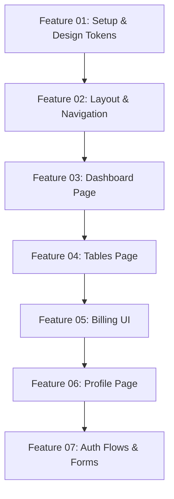

# Professional Implementation Plan: Purity UI Dashboard Conversion

This document serves as the master engineering blueprint and roadmap for converting the Purity UI Dashboard design screenshots into a pixel-perfect, production-ready React + Tailwind CSS frontend application.

---

## 1. Project Analysis & Scope

### 1.1 Product Analysis

- **Product Purpose:** A premium dashboard interface providing analytics, billing management, user profile settings, and authorization flows. It replicates the clean, modern look of the original Chakra UI Dashboard using a pure React + Tailwind CSS tech stack.
- **Core Business Goals:** Provide a highly polished, responsive, and performance-optimized SaaS/Admin boilerplate or standalone dashboard client project to showcase pixel-matching fidelity and clean engineering standards.
- **User Experience (UX) Goals:**
  - Deliver a seamless, responsive layout that scales elegantly across all screen sizes (mobile, tablet, laptop, large desktop).
  - Ensure micro-animations and interactive states (hover, focus, active navigation) feel premium and tactile.
  - Minimize cumulative layout shifts (CLS) and maximize perceived performance.
- **User Workflows:**
  1.  **Authentication Workflow:** Anonymous user lands on `/sign-in` or `/sign-up`, logs in, and gets redirected to `/dashboard`.
  2.  **Analytics Workflow:** Logged-in user analyzes key business stats, interacts with interactive charts, and views recent project items.
  3.  **Data Management Workflow:** User navigates to `/tables` to monitor member roles, project statuses, budgets, and edit details.
  4.  **Billing Workflow:** User visits `/billing` to inspect credit card details, invoices, billing profiles, and recent transactions.
  5.  **Profile Workflow:** User views profile details, toggles application settings, and inspects related conversations/projects.

### 1.2 Technical Analysis

- **Frontend Framework:** React 18+ powered by Vite for fast hot-module reloading (HMR) and optimized production bundles.
- **Styling System:** Tailwind CSS for a utility-first, theme-extended design system (custom cards, shadows, and color palettes matching Chakra UI presets).
- **Routing:** React Router DOM (v6+) with layout-nested routing (`DashboardLayout` vs `AuthLayout`).
- **State Management:** React Context API for global settings (e.g., sidebar collapse states, dark/light theme options, and simulated auth state).
- **Charts Engine:** Recharts for fluid, responsive SVG-based area, line, and bar charts matching design aesthetics.
- **Animations:** Framer Motion for sidebar transitions, route changes, card hovers, and page loads.
- **Icons:** Lucide React for consistent, lightweight vector iconography.
- **Accessibility (A11y):** WCAG 2.1 compliance (semantic HTML tags, ARIA attributes for toggles, keyboard navigation, and focus rings).
- **Performance:** Strict asset optimization (web-ready PNGs, SVGs), lazy-loading routes, and container-level component isolation.

### 1.3 UI/UX Strategy

- **Design Tokens:**
  - _Primary Color:_ `#4FD1C5` (Turquoise) / `#38B2AC` (Hover)
  - _Text Dark:_ `#2D3748` / _Text Muted:_ `#718096` / _Text Light:_ `#A0AEC0`
  - _Backgrounds:_ Page: `#F8F9FA`, Card/Sidebar: `#FFFFFF`, Dark Section: `#1A202C`
  - _Border Radius:_ Card: `20px`, Button/Input: `12px`
  - _Shadows:_ Card: `0px 7px 23px rgba(0, 0, 0, 0.05)`, Soft: `0px 4px 12px rgba(0, 0, 0, 0.04)`
- **Responsive Rules:**
  - _Mobile (<768px):_ Sidebar off-canvas (hidden, toggleable drawer), layouts stacked vertically, tables scrollable horizontally.
  - _Tablet (768px - 1023px):_ Collapsed sidebar icon-only mode, 2-column stats grid.
  - _Desktop (>=1024px):_ Sidebar fixed (250px wide), full layouts, multi-column analytics grids.

---

## 2. Serial Implementation Roadmap

The development workflow is broken down into **7 isolated, sequentially executable features**. In accordance with strict development guardrails, **only one feature may be In Progress at any time**, and it must be fully verified and documented before moving forward.

### Feature 01: Setup & Design System Initialization

- **Size:** Small
- **Goal:** Initialize the Vite + React workspace, configure Tailwind CSS design tokens, and set up base utilities.
- **Scope:**
  - Tailwind CSS custom config (`tailwind.config.js` extensions for colors, border radius, and shadows).
  - Global styles setup (`src/styles/index.css`) with base scrollbar behaviors and smooth page transitions.
  - Utility functions (`src/utils/cn.js` combining `clsx` and `tailwind-merge`).
  - Asset integration (copying and renaming PNG/SVG assets from community folder to `src/assets/images`).
- **Technical Notes:** Set up standard dev configurations. Ensure zero TypeScript or linting errors in configuration files.
- **Dependencies:** None.
- **Risks:** Typographical errors in custom tailwind extensions can lead to styling mismatch later on.
- **Definition of Done:**
  - `npm run build` succeeds with zero errors.
  - Utility `cn` passes basic string-merging validations.
  - Tailwind color/shadow tokens are verified via a temporary sandbox component.

### Feature 02: Layout Architecture & Navigation

- **Size:** Medium
- **Goal:** Construct responsive layouts, sidebar, topbar breadcrumbs, and off-canvas mobile menus.
- **Scope:**
  - `DashboardLayout` with responsive sidebar, header, and main content area.
  - `AuthLayout` with transparent topbar, central content box, and standard footer.
  - `Sidebar` component with active styling links and bottom helper CTA card.
  - `MobileSidebar` drawer with backdrop overlays and sliding animation (Framer Motion).
  - `Topbar` with breadcrumbs, mock profile action button, settings toggle, and search input.
- **Technical Notes:** Use `react-router-dom` `<Outlet />` for sub-page rendering. Keep sidebar links configured via JSON configurations.
- **Dependencies:** Feature 01.
- **Risks:** Poor overlay handling on mobile devices blocks main layout interaction.
- **Definition of Done:**
  - Sidebar properly highlights routes.
  - Mobile drawer opens/closes via burger menu with standard touch overlays.
  - Breadcrumbs accurately reflect routing state (e.g. `/tables` displays `Pages / Tables`).

### Feature 03: Dashboard Analytics & Charts

- **Size:** Large
- **Goal:** Build the main dashboard metrics grid, charts, projects list, and orders timeline.
- **Scope:**
  - `StatCard` component presenting values, percentage trends (green/red indicators), and specific icons.
  - `WelcomeCard` and brand promotion card with background patterns.
  - `SatisfactionRate` card (circular progress visualization) and `ReferralTracking` card.
  - `ActiveUsersChart` using Recharts Bar Chart (rounded bars, customized grids).
  - `SalesOverviewChart` using Recharts Area/Line Chart (gradients, smooth curves).
  - Mini `ProjectsTable` and `OrdersOverview` timeline layout.
- **Technical Notes:** Wrap Recharts inside responsive containers to avoid width overflows. Use mock stats data from `src/data/stats.js`.
- **Dependencies:** Feature 02.
- **Risks:** Chart rendering lag on mobile devices or sizing breakages on high-DPI screens.
- **Definition of Done:**
  - Stats cards align correctly in 4-column (desktop) / 2-column (tablet) / 1-column (mobile) grids.
  - Charts scale responsively when resizing windows.
  - Mini table fits within its card container without vertical/horizontal overflow.

### Feature 04: Tables Page UI

- **Size:** Medium
- **Goal:** Implement the Authors and Projects Tables with custom status badges, progress bars, and overflow containers.
- **Scope:**
  - `AuthorsTable` showing user avatars, emails, custom role badges (e.g. Admin, Member), employment dates, and edit buttons.
  - `ProjectsTable` showing budget figures, completion percentages (via stylized progress bars), and action indicators.
  - Horizontal overflow wrapper to handle table scrolling on small devices.
- **Technical Notes:** Use clean HTML `<table>` elements wrapped in custom `div` containers with `overflow-x-auto`.
- **Dependencies:** Feature 02.
- **Risks:** Table overflow breaking layout widths on 320px screens.
- **Definition of Done:**
  - Table columns match screenshot widths and align correctly.
  - Status badges render correct color states (e.g., online = green, offline = grey).
  - Horizontal scrolling triggers smoothly on screen widths <768px.

### Feature 05: Billing UI & Transactions

- **Size:** Medium
- **Goal:** Build the digital credit card visual, payment methods, invoices list, billing info cards, and transaction records.
- **Scope:**
  - `CreditCard` component with visual details (chip, expiry date, gradient background).
  - `PaymentMethodCard` featuring PayPal, Salary options, and "Add New Card" buttons.
  - `InvoiceList` with dates, dollar values, and download action links.
  - `BillingInfoCard` containing customer details (company, VAT number, email, and action items).
  - `TransactionsList` divided into "Newest" and "Yesterday" with green/red status icons (+/- amounts).
- **Technical Notes:** Ensure credit card layouts use fixed aspect ratios for realistic rendering.
- **Dependencies:** Feature 02.
- **Risks:** Complicated grid alignments of diverse cards (credit cards vs invoices vs billing details).
- **Definition of Done:**
  - Debit/Credit card renders with correct gradients.
  - Transaction values show correct sign and color (+ green, - red).
  - Spacing matches design reference cards.

### Feature 06: Profile Page & Platform Settings

- **Size:** Large
- **Goal:** Develop the User Profile page featuring a cover photo header, profile fields, platform settings toggles, and conversation list.
- **Scope:**
  - `ProfileHeader` with cover background image, user avatar overlay, and navigation tabs.
  - `PlatformSettings` section containing functional switches (HTML `<input type="checkbox">` styled as toggle switches).
  - `ProfileInfo` card documenting bio, contact details, and social icons.
  - `Conversations` list displaying user messages and reply action prompts.
  - `ProjectCard` grid exhibiting user-specific project cards with avatars and edit actions.
- **Technical Notes:** Implement custom interactive switches without third-party toggle libraries for clean Tailwind code.
- **Dependencies:** Feature 02.
- **Risks:** Floating layout overlaps of user profile card on top of the cover background image.
- **Definition of Done:**
  - Toggles transition smoothly between active and inactive states.
  - Profile header overlaps cover background correctly on mobile.
  - Projects display responsive layout changes (stacked on mobile).

### Feature 07: Authentication Flows & Forms Integration

- **Size:** Medium
- **Goal:** Construct Sign In and Sign Up pages with form validation, state management, and redirect links.
- **Scope:**
  - `SignInForm` with validation for email/password fields, "Remember Me" toggle, and navigation header.
  - `SignUpForm` containing name, email, password fields, and registration flow.
  - Split-screen layouts: Sign-in utilizes a half-and-half layout (form on left, teal brand pane on right); Sign-up utilizes a hero panel background with centered signup card.
  - Mock login state logic inside React context.
- **Technical Notes:** Incorporate error states, interactive states (focus, disabled), and form submission handling.
- **Dependencies:** Feature 02.
- **Risks:** Authentication layout scaling issues on small-scale mobile devices (e.g. right panel sizing conflicts).
- **Definition of Done:**
  - Inputs show distinct error borders when invalid data is supplied.
  - Submitting the forms triggers mock redirects to `/dashboard`.
  - Auth navbar adapts fluidly to mobile viewports.

---

## 3. Scalability & Technical Planning

### 3.1 Component Architecture

- **Atomic Foundation:** Common components (`Button`, `Card`, `Input`, `Badge`, `Toggle`, `ProgressBar`) are styled globally to ensure strict visual conformity.
- **Layout Layer:** Isolates shell systems (`Sidebar`, `Topbar`, `Footer`) to ensure page-level files contain only page-specific elements.
- **Feature Modules:** Components are grouped by page folder (`src/components/dashboard/`, `src/components/billing/`, etc.) to keep import dependencies clean and clear.

### 3.2 State Management Scalability

- For this frontend dashboard, state is handled via `AppContext`:
  - `sidebarOpen` (Boolean) - manages mobile menu visibility.
  - `user` (Object | Null) - mocks authentication details.
  - `settings` (Object) - tracks customization configs.
- If transitioning to a production backend, this setup allows for immediate drop-in replacement with Redux Toolkit or React Query.

### 3.3 Dependency Strategy

- Keep external dependencies minimal. Use standard libraries as specified in the brief:
  - `react-router-dom` for client-side routing.
  - `recharts` for charting.
  - `framer-motion` for clean interactive transitions.
  - `lucide-react` for iconography.
  - `clsx` and `tailwind-merge` for style concatenation.
